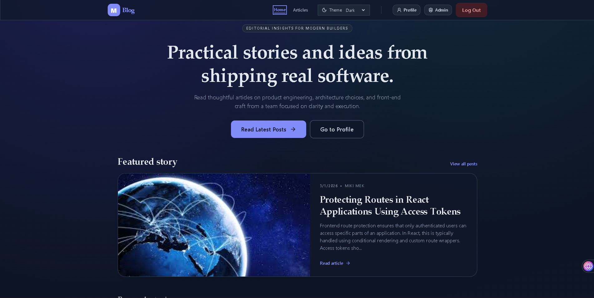
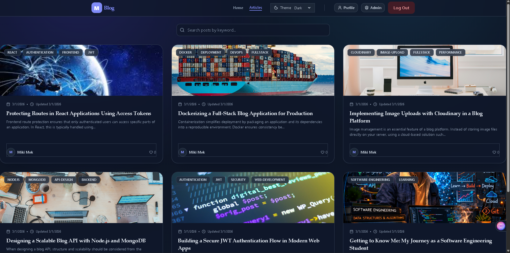
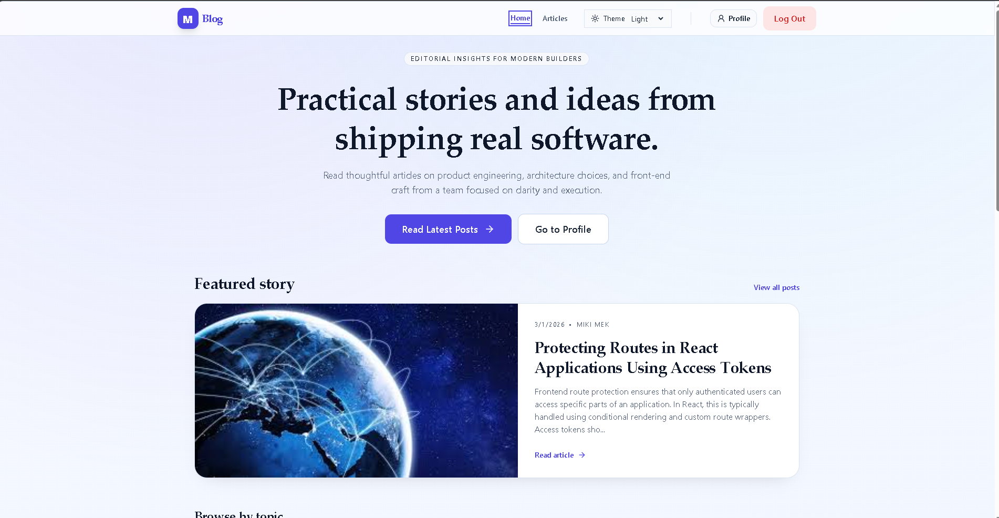

# My Blog App


## Table of Content
 - [overView](#overview)
 - [Stack](#stack)
 - [Quick Start](#quick-start)
 - [Scripts](#scripts)
 - [ Full Documentation](#full-documentation)

  ## Overview
A full-stack blog platform built for developers to share ideas and tutorials. Features include user authentication, role-based access, rich text posts, comments, and customizable themes. 
- [Live Demo](https://mblog-frl0.onrender.com)
- [GitHub Repository](https://github.com/mikimek23/blog-app)

 ### Screenshot
 
<details>
  <summary>screenshot</summary>

  #### List Posts
 
  #### Admin Dashboard
 
  #### Light mode
 
  
</details>


 ### Full-stack blog platform with:
- Public article browsing
- JWT + refresh-token authentication
- Profile pages
- Likes and moderated comments
- Role-based admin dashboard for post and user management
- App-wide `light` / `dark` / `system` theme support

## Stack

### Frontend
- React 19 + Vite
- React Router
- TanStack Query
- Tailwind CSS 4
- Axios

### Backend
- Node.js + Express 5
- MongoDB + Mongoose
- JWT auth (`access` + rotating `refresh` token)
- Joi validation
- Multer + Cloudinary (image uploads)

## Repository Layout

```text
my_blog/
├── src/                           # Frontend (React + Vite)
|   ├──api/
|   ├──assets/
|   ├──components/
|   ├──hooks/
|   ├──layout/
|   ├──pages/
|   ├── theme/
|   ├── App.jsx
|   ├── index.css
|   └── main.jsx
├── public/                        # Static assets
├── backend/                       # Backend (Express + MongoDB)
|   ├── src/
|   |   ├── config/
|   |   ├── controllers/
|   |   ├── middlewares/
|   |   ├── models/
|   |   ├── routes/
|   |   ├── services/
|   |   ├── utils/
|   |   ├── tests/
|   |   ├── __tests__/
|   |   ├── app.js
|   |   └── index.js
|   ├── jest.config.js
|   └── package.json
├── docs/
|   └── FULL_APP_DOCUMENTATION.md
├── router.jsx                     # Frontend route map
├── compose.yaml                   # Docker Compose config
├── Dockerfile                     # Container image config
├── package.json                   # Frontend scripts/deps
└── README.md
```

## Quick Start

### 1. Prerequisites
 - Node 20+
 - npm 10+
 - MongoDB

### 2. Install dependencies

```bash
# frontend deps
npm install

# backend deps
cd backend
npm install
cd ..
```

### 3. Configure environment

Create `backend/.env`:

| Variable | Required | Default / Example | Notes |
| :--- | :--- | :--- | :--- |
| `DATABASE_URL` | Yes | `mongodb://127.0.0.1:27017/my_blog` | MongoDB connection string |
| `ACCESS_TOKEN_SECRET` | Yes | `change_me_access` | JWT access token secret |
| `REFRESH_TOKEN_SECRET` | Yes | `change_me_refresh` | JWT refresh token secret |
| `PORT` | No | `5001` | Backend server port |
| `CORS_ORIGIN` | No | `http://localhost:5173` | Allowed frontend origin |
| `COOKIE_DOMAIN` | No | _(empty)_ | Cookie domain override |
| `AUTH_RATE_LIMIT_WINDOW_MS` | No | `60000` | Auth endpoint rate-limit window |
| `AUTH_RATE_LIMIT_MAX` | No | `10` | Max auth requests per window |
| `API_RATE_LIMIT_WINDOW_MS` | No | `60000` | API rate-limit window |
| `API_RATE_LIMIT_MAX` | No | `120` | Max API requests per window |
| `COMMENT_TTL_DAYS` | No | `30` | Auto-delete comments after N days |
| `TRUST_PROXY` | No | `false` | Enable when behind reverse proxy |
| `CLOUDINARY_NAME` | No | _(empty)_ | Needed only for Cloudinary uploads |
| `CLOUDINARY_KEY` | No | _(empty)_ | Needed only for Cloudinary uploads |
| `CLOUDINARY_SECRET` | No | _(empty)_ | Needed only for Cloudinary uploads |

Create frontend env file (`.env` in project root) only if backend URL differs:

| Variable | Required | Default / Example | Notes |
| --- | --- | --- | --- |
| `VITE_API_BASE_URL` | No | `http://localhost:5001/api` | Set only if backend URL differs |

### 4. Run in development

Terminal 1:

```bash
cd backend
npm run dev
```

Terminal 2:

```bash
npm run dev
```

Frontend: `http://localhost:5173`  
Backend health: `http://localhost:5001/api/health`

## Scripts

### Frontend (root)
- `npm run dev` - start Vite dev server
- `npm run build` - production build
- `npm run preview` - preview build
- `npm run lint` - ESLint

### Backend (`backend/`)
- `npm run dev` - start with nodemon
- `npm run start` - start with node
- `npm test` - Jest + Mongo memory server

## Full Documentation

For complete technical documentation (architecture, routes, API reference, auth flow, theming, testing, deployment, and troubleshooting), read:

- [docs/FULL_APP_DOCUMENTATION.md](./docs/FULL_APP_DOCUMENTATION.md)

