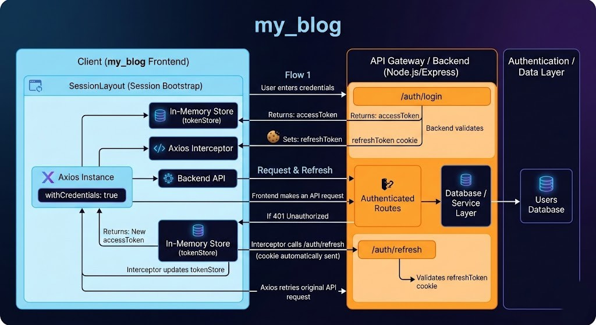

# Full App Documentation
## Table of Contents

- [1. Overview](#1-overview)
- [2. Architecture](#2-architecture)
  - [2.1 High-level flow](#21-high-level-flow)
  - [2.2 Flow Diagram](#22-flow-diagram)
  - [2.3 Tech stack](#23-tech-stack)
- [3. Project Structure](#3-project-structure)
- [4. Setup and Running](#4-setup-and-running)
  - [4.1 Prerequisites](#41-prerequisites)
  - [4.2 Install dependencies](#42-install-dependencies)
  - [4.3 Environment variables](#43-environment-variables)
  - [4.4 Development run](#44-development-run)
- [5. Frontend](#5-frontend)
  - [5.1 Route map](#51-route-map)
  - [5.2 Frontend state patterns](#52-frontend-state-patterns)
  - [5.3 Theme system](#53-theme-system)
  - [5.4 Styling system](#54-styling-system)
- [6. Backend](#6-backend)
  - [6.1 App pipeline](#61-app-pipeline-backendsrcappjs)
  - [6.2 Security and middleware](#62-security-and-middleware)
  - [6.3 Data models](#63-data-models)
- [7. Authentication and Session Lifecycle](#7-authentication-and-session-lifecycle)
  - [7.1 Token Rotation, Reuse, and Cookie Security](#71-token-rotation-reuse-and-cookie-security)
  - [7.2 Security Properties](#72-security-properties)
- [8. API Reference](#8-api-reference)
  - [8.1 Health](#81-health)
  - [8.2 Auth](#82-auth)
  - [8.3 Posts](#83-posts)
    - [8.3.1 Pagination strategy](#831-pagination-strategy)
  - [8.4 Admin Posts](#84-admin-posts)
  - [8.5 Comments and Moderation](#85-comments-and-moderation)
  - [8.6 Likes](#86-likes)
  - [8.7 Profiles](#87-profiles)
  - [8.8 Admin User Management](#88-admin-user-management)
- [9. Admin Workflow](#9-admin-workflow)
  - [9.1 Access control](#91-access-control)
  - [9.2 Post management](#92-post-management)
  - [9.3 Moderation](#93-moderation)
- [10. Validation Rules (Selected)](#10-validation-rules-selected)
- [11. Testing and Quality](#11-testing-and-quality)
- [12. Deployment Notes](#12-deployment-notes)
- [13. Troubleshooting](#13-troubleshooting)
- [14. Known Technical Notes](#14-known-technical-notes)
- [15. Maintenance Checklist](#15-maintenance-checklist)
- [16. Future Enhancements](#16-future-enhancements)
## 1. Overview

`my_blog` is a full-stack blog platform with a React frontend and an Express/MongoDB backend.

Core capabilities:
- User registration/login/logout
- Session restoration with refresh token cookies
- Public article feed and article detail pages
- Likes and comments
- Comment moderation workflow
- Public and private user profiles
- Admin dashboard:
  - Post create/edit/delete
  - User role/status management
  - Moderation queue
- App-wide theme modes: `light`, `dark`, `system`

- [Live Demo](https://mblog-frl0.onrender.com)
- [GitHub Repository](https://github.com/mikimek23/blog-app)
---

## 2. Architecture

### 2.1 High-level flow

1. Frontend calls backend API via Axios (`withCredentials: true`).
2. Backend returns `accessToken` + sets `refreshToken` cookie on login.
3. Frontend stores `accessToken` in in-memory store (`tokenStore`).
4. On `401`, Axios interceptor calls `/auth/refresh` and retries original request.
5. Session bootstrap runs on app start from `SessionLayout`.
### 2.2 Flow Diagram


### 2.3 Tech stack

Frontend:
- React 19
- Vite 7
- React Router
- TanStack Query
- Tailwind CSS v4
- React Toastify

Backend:
- Node.js (ESM)
- Express 5
- MongoDB + Mongoose
- Joi validation
- JWT (`15m` access token, `7d` refresh token)
- Multer memory uploads + Cloudinary

---

## 3. Project Structure

```text
my_blog/
├── src/
|  ├── api/                        # frontend API clients
|  ├── components/                 # reusable UI components
|  |   ├── admin/                  # admin UI
|  |   ├── comments                # comment panal UI
|  |   ├── theme/                  # theme switch UI
|  |   └──routes/                  # admin and protected route outlet
|  ├── hooks/                      # auth/theme hooks
|  ├── layout/                     # route layouts
|  ├── pages/                      # route pages
|  ├── theme/                      # theme provider/runtime
|  ├── index.css                   # global tokens and theme styling
|  ├── main.jsx                    # app bootstrap
|  └── App.jsx                     # app shell
├── backend/
|  └── src/
|     ├── app.js                   # express app wiring
|     ├── index.js                 # server entrypoint
|     ├── routes/                  # route definitions
|     ├── controllers/             # request handlers
|     ├── services/                # business logic
|     ├── models/                  # mongoose models
|     ├── middlewares/             # auth, security, rate-limit, upload, errors
|     ├── config/                  # env and cloudinary config
|     └── tests/                   # jest setup helpers
├── router.jsx                     # frontend route map
└── docs/
    └── FULL_APP_DOCUMENTATION.md  # full documentation
```

---

## 4. Setup and Running

## 4.1 Prerequisites
- Node.js 20+
- npm 10+
- MongoDB (local or hosted)

## 4.2 Install dependencies

```bash
npm install
cd backend
npm install
cd ..
```

## 4.3 Environment variables

### Backend (`backend/.env`)

| Variable | Required | Default / Example | Notes |
| :--- | :--- | :--- | :--- |
| `DATABASE_URL` | Yes | `mongodb://127.0.0.1:27017/my_blog` | MongoDB connection string |
| `ACCESS_TOKEN_SECRET` | Yes | `change_me_access` | JWT access token secret |
| `REFRESH_TOKEN_SECRET` | Yes | `change_me_refresh` | JWT refresh token secret |
| `PORT` | No | `5001` | Backend server port |
| `CORS_ORIGIN` | No | `http://localhost:5173` | Allowed frontend origin |
| `COOKIE_DOMAIN` | No | _(empty)_ | Cookie domain override |
| `AUTH_RATE_LIMIT_WINDOW_MS` | No | `60000` | Auth endpoint rate-limit window |
| `AUTH_RATE_LIMIT_MAX` | No | `10` | Max auth requests per window |
| `API_RATE_LIMIT_WINDOW_MS` | No | `60000` | API rate-limit window |
| `API_RATE_LIMIT_MAX` | No | `120` | Max API requests per window |
| `COMMENT_TTL_DAYS` | No | `30` | Auto-delete comments after N days |
| `TRUST_PROXY` | No | `false` | Enable when behind reverse proxy |
| `CLOUDINARY_NAME` | No | _(empty)_ | Needed only for Cloudinary uploads |
| `CLOUDINARY_KEY` | No | _(empty)_ | Needed only for Cloudinary uploads |
| `CLOUDINARY_SECRET` | No | _(empty)_ | Needed only for Cloudinary uploads |

### Frontend (root `.env`, optional)
| Variable | Required | Default / Example | Notes |
| --- | --- | --- | --- |
| `VITE_API_BASE_URL` | No | `http://localhost:5001/api` | Set only if backend URL differs |

## 4.4 Development run

```bash
# terminal 1
cd backend
npm run dev

# terminal 2
npm run dev
```

URLs:
- Frontend: `http://localhost:5173`
- API health: `http://localhost:5001/api/health`

---

## 5. Frontend

## 5.1 Route map

From `router.jsx`:

Public:
- `/` -> Home
- `/posts` -> Blog list
- `/posts/:id/:slug?` -> Single post
- `/users/:username` -> Public profile
- `/login`
- `/signup`
- `/admin/login`

Protected:
- `/profile` (authenticated user)

Admin (authenticated + role `admin`):
- `/admin/dashboard`
- `/admin/posts`
- `/admin/posts/create`
- `/admin/posts/:id/edit`
- `/admin/users`
- `/admin/moderation`

## 5.2 Frontend state patterns

- Server state: TanStack Query
- Auth/session state: custom external store (`src/hooks/tokenStore.js`)
- Theme state: `ThemeProvider` context (`light` / `dark` / `system`)

## 5.3 Theme system

Files:
- `src/theme/theme.js`
- `src/theme/ThemeContext.js`
- `src/theme/ThemeProvider.jsx`
- `src/hooks/useTheme.js`
- `src/components/theme/ThemeToggle.jsx`

Behavior:
- First load defaults to `system` preference.
- Preference stored in `localStorage` key: `mblog-theme`.
- Pre-hydration script in `index.html` applies theme before React renders.
- Runtime sets:
  - `document.documentElement.dataset.theme`
  - `document.documentElement.style.colorScheme`

Theme toggle locations:
- Public navbar (desktop + mobile)
- Admin dashboard header

## 5.4 Styling system

Global semantic tokens and utilities are defined in `src/index.css`:
- Surface/background tokens for both light and dark themes
- Text, accent, border, success, danger tokens
- Utility component classes:
  - `.ui-surface`, `.ui-surface-soft`, `.ui-input`, `.ui-chip`
  - `.ui-text`, `.ui-text-muted`, `.ui-heading`
  - `.ui-alert-success`, `.ui-alert-error`
- Global focus-visible ring for accessibility
- Reduced motion support

---

## 6. Backend

## 6.1 App pipeline (`backend/src/app.js`)

Middleware order:
1. `securityHeaders`
2. `express.json`
3. `cookieParser`
4. `sanitizeInput`
5. global rate limiter
6. CORS (`credentials: true`)
7. route mounting
8. 404 fallback
9. `errorHandler`

## 6.2 Security and middleware

- `authMiddleware`: required JWT access token
- `optionalAuthMiddleware`: access token optional
- `requireRole(...roles)`: role gate (`admin`)
- `sanitizeInput`: removes script/javascript patterns in body/query
- `securityHeaders`: common hardening headers
- `createRateLimiter`: in-memory IP-based limiter

## 6.3 Data models

### `User`
- `username`, `email`, `password`, `role`, `bio`, `avatarUrl`, `isActive`
- `refreshTokenHash`, `refreshTokenExpiresAt`

### `Post`
- `title`, `content`, `author`, `tags`, `slug`, `imageUrl`, `imagePublicId`

### `Comment`
- `post`, `author`, `content`
- moderation fields: `moderationStatus`, `isFlagged`, `flaggedReason`
- TTL field: `expiresAt` (TTL index enforced)

### `Like`
- `post`, `user`
- unique index on (`post`, `user`)
### Index Strategy

To ensure query performance and enforce data integrity, the following indexes are used:

- `User.email`: **unique index**
  - Prevents duplicate accounts and speeds up login/email lookup.

- `User.username`: **unique index**
  - Ensures unique public identity and supports fast profile lookup.

- `Comment.expiresAt`: **TTL index**
  - Automatically removes expired comments without manual cleanup jobs.

- `Like(post, user)`: **compound unique index**
  - Prevents duplicate likes from the same user on the same post and improves like existence checks.

---

## 7. Authentication and Session Lifecycle

1. `POST /api/auth/login` validates credentials.
2. API returns:
   - `data.accessToken`
   - `data.user`
   - sets `refreshToken` cookie (`httpOnly`)
3. Frontend sends access token in `Authorization` header.
4. On expired access token:
   - Axios interceptor calls `POST /api/auth/refresh`
   - updates token and retries original request once.
5. Logout clears both frontend session state and backend cookie/token hash.

Token details:
- Access token: `15m`
- Refresh token: `7d`, rotating on refresh

### 7.1 Token Rotation, Reuse, and Cookie Security

#### Token rotation and invalidation logic
- On login, the server issues:
  - Access token (`15m`)
  - Refresh token (`7d`)
- Only the hash of the refresh token is stored in DB (`refreshTokenHash`) with `refreshTokenExpiresAt`.
- On `/auth/refresh`, the server:
  - Verifies refresh JWT signature and `type=refresh`
  - Loads the user/session record
  - Compares incoming token hash vs stored `refreshTokenHash`
- If valid, it rotates tokens:
  - New access token is returned
  - New refresh token is set in cookie
  - Stored hash is replaced (old refresh token becomes invalid)

#### What happens if refresh token reuse is detected
- If a previously rotated (old) refresh token is sent again, hash comparison fails.
- Response is `403 Invalid refresh token`.
- Current behavior: request is denied, but there is no separate reuse-incident workflow (for example, forced global logout + security alert).

#### Why refresh token is stored hashed in DB
- If DB is leaked, attackers do not get usable bearer refresh tokens.
- Server can still validate tokens by hashing incoming token and comparing hashes.
- This follows the same principle as password storage: avoid storing sensitive credentials in plaintext.

#### Refresh cookie flags
- `httpOnly: true`: prevents JavaScript access to the refresh token.
- `sameSite: 'none'` in production, `'lax'` in development.
- `secure: true` in production (`false` in development), so cookies are sent over HTTPS only.
- `maxAge: 7d`, `path: /api`, `domain: COOKIE_DOMAIN` (optional).

### 7.2 Security Properties

- **XSS mitigation (in-memory access token)**
  - Access tokens are stored in memory (not `localStorage`/`sessionStorage`), so they are less exposed to token theft and do not persist after reload.
  - This limits blast radius if XSS occurs.

- **CSRF mitigation strategy**
  - Protected APIs use `Authorization: Bearer <accessToken>` instead of cookie-based auth, which reduces CSRF exposure.
  - Refresh flow still uses cookies, so mitigation relies on:
    - strict CORS origin allowlist
    - `credentials: true`
    - secure cookie flags (`httpOnly`, `sameSite`, `secure`)
  - Note: no separate CSRF token is implemented yet.

- **Why `withCredentials` is required**
  - Refresh token is stored in an `httpOnly` cookie (frontend JS cannot read it).
  - `withCredentials: true` is required so browser includes cookie on requests like `/auth/refresh` and accepts `Set-Cookie` from backend.

- **Why refresh tokens are rotated**
  - Every refresh returns a new refresh token and updates the stored hash in DB.
  - The previous refresh token becomes invalid.
  - This reduces replay risk and improves session security if a token is leaked.
---

## 8. API Reference

Base URL: `/api`

Standard success envelope:

```json
{
  "success": true,
  "message": "OK",
  "data": {},
  "meta": {}
}
```

Standard error envelope:

```json
{
  "success": false,
  "message": "Error message",
  "code": "ERROR_CODE",
  "errors": []
}
```

## 8.1 Health
- `GET /health`

## 8.2 Auth
- `POST /auth/register`
- `POST /auth/login`
- `POST /auth/refresh`
- `POST /auth/refresh-token` (compat alias)
- `POST /auth/logout`
- `GET /auth/me` (auth required)
- `GET /auth/:id` (compat path, auth required)

## 8.3 Posts
- `GET /posts`
  - Query: `page`, `limit`, `sortBy`, `sortOrder`, `cursor`, `author`, `tag`, `search`
- `GET /posts/slug/:slug`
- `GET /posts/:id`

### 8.3.1 Pagination strategy
- it is `_id` based for cursor pagination. `cursor` is a MongoDB ObjectId and the backend applies `_id < cursor`.
-  The API returns `nextCursor` and `hasNextPage` for forward navigation only.
- Fully stable when sorting by `_id` descending.
- For post list sorting by `title`, `updatedAt`, or `createdAt` ties, `_id` cursoring can produce duplicates/skips across pages.
- Additional note: `GET /posts` supports both offset pagination (`page`, `limit`) and cursor pagination (`cursor`, `nextCursor`).

## 8.4 Admin Posts
- `POST /admin/posts` (admin)
- `PATCH /admin/posts/:id` (admin)
- `DELETE /admin/posts/:id` (admin)
- Compat alias: `/admin/post/*`

## 8.5 Comments and Moderation
- `GET /posts/:postId/comments`
- `POST /posts/:postId/comments` (auth)
- `DELETE /comments/:id` (owner/admin)
- `PATCH /comments/:id/flag` (auth)
- `GET /admin/moderation/comments` (admin)
  - Query: `status`, `flaggedOnly`, `limit`, `cursor`
- `PATCH /admin/moderation/comments/:id/status` (admin)

## 8.6 Likes
- `GET /posts/:postId/likes` (optional auth)
- `POST /posts/:postId/likes/toggle` (auth)

## 8.7 Profiles
- `GET /profiles/:username`
  - Query: `limit`, `cursor`
- `GET /profiles/me` (auth)
- `PATCH /profiles/me` (auth)

## 8.8 Admin User Management
- `GET /admin/users` (admin)
  - Query: `search`, `limit`, `cursor`
- `PATCH /admin/users/:id/role` (admin)
- `PATCH /admin/users/:id/status` (admin)

---

## 9. Admin Workflow

## 9.1 Access control
- Admin routes are guarded both frontend and backend.
- User must be authenticated and have role `admin`.

## 9.2 Post management
- Create/update supports multipart form with optional image upload.
- If uploading binary image, Cloudinary config must be valid.
- Alternatively, image URL can be sent without file upload.

## 9.3 Moderation
- User comments default to `pending`.
- Admin comments auto-approve.
- Flagging a comment sets it back to `pending`.

---

## 10. Validation Rules (Selected)

- Registration:
  - `username` min 3
  - valid `email`
  - `password` min 6
- Comment content:
  - 2 to 1200 chars
- Profile updates:
  - `bio` max 280
  - `avatarUrl` must be a URI
- ID params:
  - must be 24-char Mongo ObjectId

Source: `backend/src/utils/inputValidation.js`

---

## 11. Testing and Quality

Frontend:
- `npm run lint`
- `npm run build`

Backend:
- `cd backend && npm test`

Backend tests use:
- Jest
- mongodb-memory-server (`globalSetup` / `globalTeardown`)

---

## 12. Deployment Notes

- Use HTTPS in production so secure cookies work reliably.
- Set `NODE_ENV=production`.
- Configure `CORS_ORIGIN` to deployed frontend domain(s).
- Set `COOKIE_DOMAIN` if needed for subdomain deployments.
- Configure `TRUST_PROXY=true` behind a reverse proxy.
- Provide strong random values for JWT secrets.

---

## 13. Troubleshooting

### `401` loops on frontend
- Verify backend `ACCESS_TOKEN_SECRET`/`REFRESH_TOKEN_SECRET` are stable.
- Confirm browser accepts `refreshToken` cookie.
- Check `CORS_ORIGIN` and `withCredentials`.

### Image upload failures
- Ensure `CLOUDINARY_NAME`, `CLOUDINARY_KEY`, and `CLOUDINARY_SECRET` are set.
- Check file type (`jpeg/png/webp/gif`) and max size (`5MB`).

### Admin access denied
- Confirm user role in DB is `admin`.
- Registration creates regular users by default.

### Comments disappearing quickly
- Current comment model default TTL is short (`COMMENT_TTL_MS` in model).
- Review `backend/src/models/comments.js` and adjust TTL behavior if needed.

---

## 14. Known Technical Notes

- Rate limiting is in-memory (not distributed); use Redis/store-backed limiter for horizontal scaling.
- There is a compatibility alias for admin post routes (`/api/admin/post`) during migration.
- `COMMENT_TTL_DAYS` exists in env config but is not currently used to compute `expiresAt` in comment creation/model defaults.

---

## 15. Maintenance Checklist

When adding new features:
1. Add backend validation schema first.
2. Add/adjust service logic.
3. Wire controller and route.
4. Add frontend API client call.
5. Add UI + query invalidation.
6. Validate:
   - lint
   - build
   - route guards
   - dark/light theme readability

---

## 16. Future Enhancements

### Drafts + scheduled publishing
   - Allow authors to save draft posts and publish immediately or at a scheduled datetime.
   - Add post status states (`draft`, `scheduled`, `published`) and a background publish job.

### Rich text editor with Markdown support
   - Upgrade the post editor to support Markdown shortcuts, headings, code blocks, and image embeds.
   - Store canonical Markdown and render sanitized HTML on read.

### Post bookmarks (save for later)
   - Let authenticated users bookmark/unbookmark posts.
   - Add a "Saved Posts" view under the user profile/dashboard.

### Email verification + password reset flow
   - Require email verification for new accounts before enabling full privileges.
   - Add secure password reset via expiring, single-use tokens.

### Post analytics dashboard
   - Show per-post metrics such as views, likes, comments, and engagement trends.
   - Provide author-level and admin-level summary cards for top-performing content.
